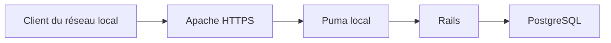

# Exploitation de vidb

Ce document décrit l’instance de production de `vidb`. Il ne contient aucun secret ;
les mots de passe, clés et jetons restent hors du dépôt.

## Architecture



- Apache écoute sur les ports 80 et 443 ; HTTP redirige vers HTTPS.
- Apache accepte uniquement le réseau local et transmet les requêtes à Puma.
- Puma écoute sur `127.0.0.1:3000`, jamais directement sur le réseau.
- PostgreSQL est utilisé localement par le rôle dédié `vidb`.

L’URL de production est `https://zeus.fodiman.fr/`. Les postes du réseau local
doivent résoudre ce nom vers l’adresse locale de Zeus ; le certificat TLS est
émis pour ce nom, pas pour son adresse IP.

## Services

Les services suivants doivent être actifs et activés au démarrage :

```sh
systemctl is-enabled postgresql apache2 vidb
systemctl is-active postgresql apache2 vidb
```

Le service Rails est défini par `/etc/systemd/system/vidb.service` et exécute
Puma sous l’utilisateur système `vidb`.

Les variables de production sont dans `/etc/vidb/vidb.env`, lisible seulement
par `root` et le groupe `vidb`. Ce fichier contient notamment :

- `SECRET_KEY_BASE` ;
- `VIDB_DATABASE_NAME` et `VIDB_DATABASE_USER` ;
- `VIDB_HOST` ;
- les paramètres Puma.

Ne pas afficher, transmettre ni versionner ce fichier.

## Releases

Les releases sont indépendantes du répertoire de développement : elles sont
créées depuis un commit précis de `origin/main` avec `git archive`.

```text
/srv/vidb/releases/<commit-complet>
/srv/vidb/shared/bundle
/srv/vidb/shared/storage
/srv/vidb/shared/tmp
/srv/vidb/current -> releases/<commit-complet>
```

`storage` et `tmp` sont des liens vers les répertoires partagés. Les dépendances
de production sont installées dans le bundle partagé.

Pour déployer une nouvelle version :

1. valider le commit en développement avec `bin/check` ;
2. pousser ce commit sur `origin/main` ;
3. créer une release depuis son SHA complet, sans copier le répertoire de
   développement ;
4. relier `storage` et `tmp`, installer les gems de production et précompiler
   les assets ;
5. vérifier le démarrage Rails et l’état des migrations dans la release ;
6. basculer atomiquement `/srv/vidb/current` vers la release, puis redémarrer
   `vidb` ;
7. vérifier le service et une réponse HTTPS `200`.

Les releases précédentes sont conservées. Sans migration incompatible, un
retour arrière consiste à repointer `current` vers la release précédente et à
redémarrer le service.

## Déploiement d’une nouvelle version

Depuis le dépôt de développement :

1. valider les changements :

   ```shell
   bin/check
   ```

2. pousser le commit validé sur `origin/main` :

   ```shell
   git push origin main
   ```

3. simuler le déploiement du dernier commit distant :

   ```shell
   bin/deploy-production --dry-run
   ```

4. si le plan affiché est correct, effectuer le déploiement :

   ```shell
   bin/deploy-production
   ```

Le script demande une confirmation explicite. Il :

1. crée une release temporaire depuis le commit de `origin/main` avec
    `git archive` ;
2. relie `storage` et `tmp` aux répertoires partagés ;
3. installe les gems de production et précompile les assets ;
4. vérifie le démarrage Rails, la base `vidb_production` et les migrations ;
5. promeut la release et bascule atomiquement `/srv/vidb/current` ;
6. redémarre `vidb` ;
7. vérifie le service, l’écoute locale de Puma et HTTPS ;
8. revient à la release précédente si un contrôle échoue après la bascule.

Pour déployer un commit précis déjà présent sur `origin/main`, transmettre son SHA  complet, par exemple :

```shell
bin/deploy-production e97f7881f0f7e4f641245c2d91ff35cf713cdef4
```

Les releases précédentes sont conservées. En l’absence de migration
 incompatible, un retour arrière manuel consiste à repointer `current` vers la
 release précédente, puis à redémarrer le service.

## Contrôles après déploiement

```sh
systemctl --no-pager --full status vidb

curl --silent --show-error --output /dev/null \
  -w 'HTTPS %{http_code}\n' \
  --max-time 10 \
  https://zeus.fodiman.fr/

journalctl --unit vidb --since '-10 minutes' --no-pager
```

La base de production canonique est `vidb_production`, détenue par le rôle
PostgreSQL `vidb`. Une sauvegarde PostgreSQL au format personnalisé doit être
faite avant toute opération structurelle ou destructive.

## Certificat TLS

Le certificat Let’s Encrypt est obtenu par le défi DNS-01 Gandi avec `lego`.
Le renouvellement est assuré par :

```text
vidb-certificate-renewal.timer
vidb-certificate-renewal.service
```

Le timer s’exécute chaque nuit. Il recharge Apache seulement si le certificat
a été renouvelé.

Vérifications utiles :

```sh
systemctl list-timers vidb-certificate-renewal.timer
journalctl --unit vidb-certificate-renewal.service --no-pager
```

Le jeton Gandi est stocké hors du dépôt dans `/etc/lego/gandi-token`. Sa date
d’expiration est suivie dans `/etc/lego/gandi-token-expires`. Son remplacement
est une opération manuelle : créer un nouveau jeton à droits DNS limités,
remplacer le fichier protégé, puis lancer une vérification de renouvellement.

## Courriels Devise

Les liens de courriel utilisent `VIDB_HOST` et le protocole HTTPS. La livraison
effective des courriels nécessitera une configuration SMTP lorsque cette
fonctionnalité sera activée.
